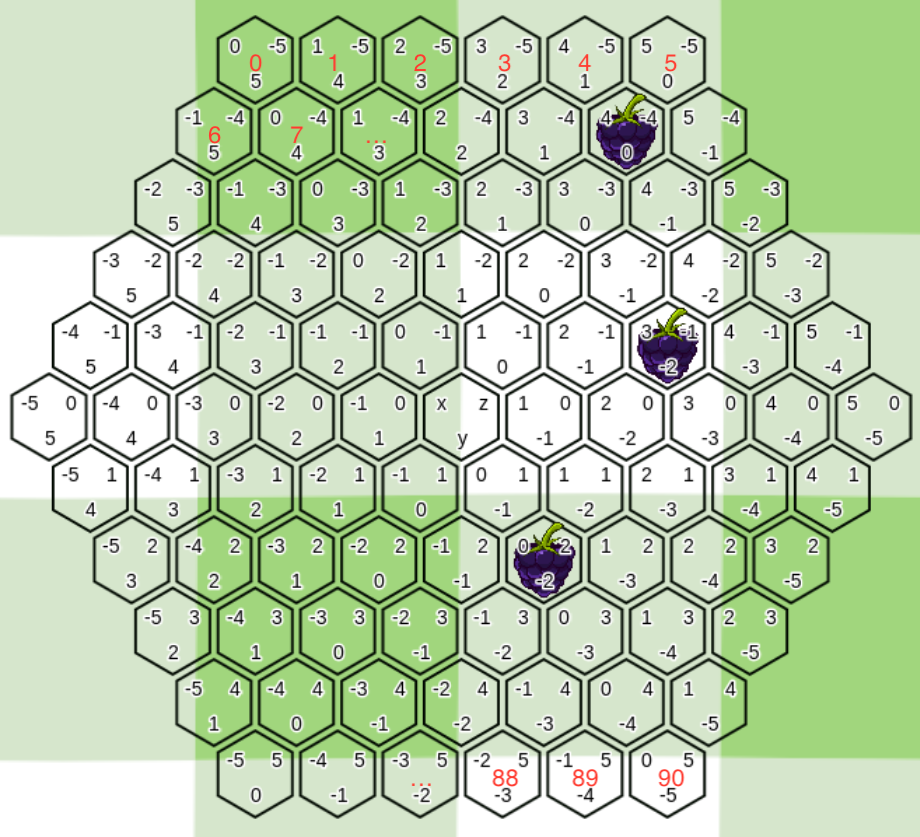

# State Hashing 

## The Board


## Information to Store

To hash a state it is required to store all information needed to uniquely identify it.
Therefore we need to store the information about all deployed pieces and the current player.
The information about the pieces includes the piece's type, owner and position.

### Breaking it Down

The big question is how to store the required information efficient. This implies three main design goals: 

- The hash function must be fast
- The resulting hash must be as small as possible
- The hashes must be collision free

Let's start by grouping the information we have. First there are the pieces which identify the state. And of course as the second information we must 
store the current player too. The easy part first: The current player can be uniquely identified by a single bit of information whether it's the red 
one or not. This results in a minimum memory size required for the player of **one** bit. Nice!
The pieces are a bit more complicated. To identify a piece we need the information about it's position, type and owner. The owner is again just a 
single bit. Done. The type can be either ant, beetle, bee, grasshopper or spider. The position is a bit trickier. At a glance we would need three 
numbers: The x, y and z position. But let's break it down even more. First we must decide which information we want: We want to identify each position 
uniquely and there are 91 fields. So each position can be represented by a number between 0 and 90 (inclusive). 

### Piece Hash

Hashing a piece is quite straight forward. We can see it's type as a number between 0 and 4 and it's owner as a number between 0 and 1. 

```swift
func hash(piece: Piece) -> UInt {
    return (piece.type << 1) ^ piece.owner
}
```

**Demo:** 
Required Bits: 4
|                   | Type Information  | Owner     | 
|-------------------|-------------------|-----------|
| Size              | 3 bit             | 1 bit     |
| Effective Range   | 0 to 4            | 0 to 1    |
| Allocated Range   | 0 to 7            | 0 to 1    |
| Example           | 0b110 - 4         | 0b1 - 1   |

### Position Hash

To create the smallest possible hash for a position the given information must be transformed into a smaller format. This means in practise that we 
have to translate the given coordinates into a single number: the index of the position.
Therefore we need some extra steps to achieve the following:



How to do? When we get a position we iterate from -5 until the z-position of the given one to calculate the number of fields which are in the rows 
above our given position. For example at position (-1, 5, -4) we can see that 6 fields are in the row above. To calculate the fields at a specific z 
position we can use 

```swift
func items(at zPosition: Int) -> Int {
    return 11 - abs(zPosition)
}
```

The x-position gives us information about the index at it's row. But before we can use it we need to normalize it. Let's say we are in the second row. 
The first x coordinate is -1. We need to add 1 to each x position to have a normalized index starting at 0. The same is true until z = -1. Afterwards 
we only need to add 5 to the x-coordinate.

```swift
func normalize(x: Int, at z: Int) -> Int {
    if z > -1 {
        return x + 5
    }
    
    return x + items(at: z) - 6
}
```

Combinig all these functions gives us our final index function.

```swift
func index(x: Int, z: Int) -> Int {
    var countOfFieldsAbove = 0
    
    for i in -5..<z {
        countOfFieldsAbove += items(at: i)
    }
    
    return countOfFieldsAbove + normalize(x: x, at: z)
}
```

**Demo:** 
Required Bits: 7
|                   |  Position         | 
|-------------------|-------------------|
| Size              | 7 bit             |
| Effective Range   | 0 to 90           | 
| Allocated Range   | 0 to 127          |

## Putting it all Together

Finally we know how to hash all pieces we need to identify our state and/or pieces. We just need to combine them and we should be done. 
Sounds easy but we still have to take some points into account. Our first decision should be how to express the given information. 
Since the size of the resulting hash should be minimized, a fixed-length hash with desired bit positions for each piece should be choosen.
This method gets rid of the need to store the information about the piece (type, owner) since each piece has a fixed position which identifies it.
The hash will look the following:

| Red Ants | Blue Ants | Red Spiders | Blue Spiders | Red Beetles | Blue Beetles | Red Grasshoppers | Blue Grasshoppers | Red Bee | Blue Bee | Current Player |
|-|-|-|-|-|-|-|-|-|-|-|-|
|3 x 7 Bits|3 x 7 Bits|3 x 7 Bits|3 x 7 Bits|2 x 7 Bits|2 x 7 Bits|2 x 7 Bits|2 x 7 Bits|1 x 7 Bits|1 x 7 Bits|1 Bit|

The hash consists only of the absolutly necessary information. Each piece has it's position expressed by the seven bit index. The type and owner are 
indirectly assigned by the position in the hash. Because a position does not use the full range available in a 7 bit integer, undeployed pieces can use 
for example 0b1111111 (127). The final and mimimal hash size is therefore 155 bits <-> 20 byte.

## Sample Code 

This version is just a proof of concept with Swift syntax. The used types (e.g. `Position`, `State`, ...) are not declared in this example and must at
least contain the used properties for this sample code or similar ways to access the same information. 
The in-detail implementation with the language of your choice can vary.

```swift
// Example of how to store the 155 bit hash

class HashKey {

    // The effective length of the combined hash. It's not the overall capacity but the used capacity
    private (set) var count: Int = 0
    
    // UInt32 chunks for an 155 bit hash result in an overhead of only 5 bit
    private (set) var data: [UInt32] = [0]
    
    private var lastIndex: Int {
        data.count - 1
    }
    
    // The capacity available in the hash
    var capacity: Int {
        data.count * 32
    }
    
    // The memory footprint of the HashKey instance in bytes
    var memorySize: Int {
        // Capacity * allocated space for each chunk + allocated space for `count`
        // In case of 155 bit key => 5 * 4 + 8 = 28 Byte = 224 Bit
        capacity * 4 + 8
    }
    
    func push(_ chunk: UInt32, effectiveLength: Int) {
        let size = count % 32                                   // The effective size of the last number in data
        let availableBits = 32 - size                           // The bits available in the last number
        
        if size == 0 && count > 0 {                             // The last UInt32 in data is empty and not the first item
            data += [chunk]                                     // Append whole chunk to data
        } else {
            data[lastIndex] = chunk << size ^ data[lastIndex]   // Add as many bits to the last number as available
        }
        
        if effectiveLength > availableBits {                    // If chunk is bigger than the available space in the last number
            data += [chunk >> availableBits]                    // Create a new number with the remaining bits and add it to data
        }
        
        count += effectiveLength                                // Increase count by bytes added
    }
    
    func push(other number: UInt8, effectiveLength: Int) {
        push(UInt32(number), effectiveLength: effectiveLength)  // Simple cast from UInt8 to UInt32
    }
    
    func push(other number: UInt64, effectiveLength: Int) {
        let leading = UInt32(number >> 32)                                          // The first 32 bits
        let trailing = UInt32((number << 32) >> 32)                                 // The last 32 bits
        let leadingLength = effectiveLength - 32 > 0 ? effectiveLength - 32 : 0     // The effective length of the first 32 bits
        let trailingLength = effectiveLength - leadingLength                        // The effective length of the last 32 bits
        
        push(trailing, effectiveLength: trailingLength)
        push(leading, effectiveLength: leadingLength)
    }
    
    func compare(to other: HashKey) -> Bool {
        guard other.count == count else {                   // Check whether both keys have the same effective length 
            return false                                    // Otherwise they cannot be equal
        }
        
        for index in 0..<data.count {                       // Iterate data chunks
            if data[index] != other.data[index] {           // Compare UInt32 integers
                return false                                // If anyone is not equal -> return false
            }
        }
        
        return true
    }
    
}

// Functions to calculate the index of a position

func items(at zPosition: Int) -> Int {
    return 11 - abs(zPosition)
}

func normalize(x: Int, at z: Int) -> Int {
    if z > -1 {
        return x + 5
    }
    
    return x + items(at: z) - 6
}

func index(x: Int, z: Int) -> Int {
    var countOfFieldsAbove = 0
    
    for i in -5..<z {
        countOfFieldsAbove += items(at: i)
    }
    
    return countOfFieldsAbove + normalize(x: x, at: z)
}

// Actual Hash Function & Helper

func addPosition(of piece: Piece, to hash: HashKey) {
    hash.push(index(x: piece.position.x, z: piece.position.z), effectiveLength: 7)
}

func addUndeployed(to hash: HashKey) {
    hash.push(0b1111111, effectiveLength: 7)
}

func addPieces(of color: Color, type: PieceType, to hash: HashKey) {
    if color == .red {
        for piece in state.red.pieces(type: type) {
            addPosition(of: piece, to: hash)
        }

        for piece in state.red.undeployed(type: type) {
            addUndeployed(to: hash)
        } 
    } else {
        for piece in state.blue.pieces(type: type) {
            addPosition(of: piece, to: hash)
        }

        for piece in state.blue.undeployed(type: type) {
            addUndeployed(to: hash)
        } 
    }
}

func hash(state: State) -> HashKey {
    let hash = HashKey()
    
    hash.push(state.currentPlayer == .red ? 0 : 1, effectiveLength: 1)
    
    addPieces(of: .red, type: .ant, to: hash)
    addPieces(of: .blue, type: .ant, to: hash)
    
    addPieces(of: .red, type: .spider, to: hash)
    addPieces(of: .blue, type: .spider, to: hash)
    
    addPieces(of: .red, type: .beetle, to: hash)
    addPieces(of: .blue, type: .beetle, to: hash)
    
    addPieces(of: .red, type: .grasshopper, to: hash)
    addPieces(of: .blue, type: .grasshopper, to: hash)
    
    addPieces(of: .red, type: .bee, to: hash)
    addPieces(of: .blue, type: .bee, to: hash)
    
    return hash
}

```